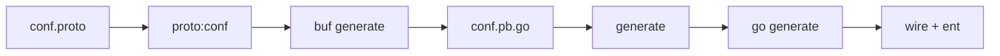
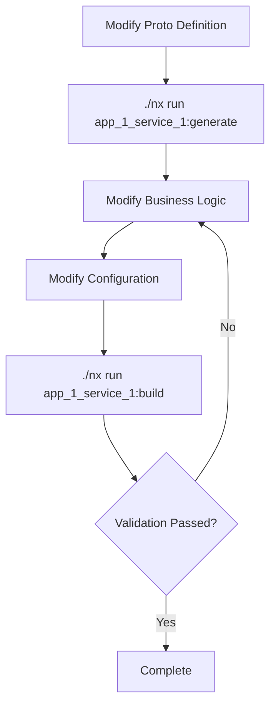
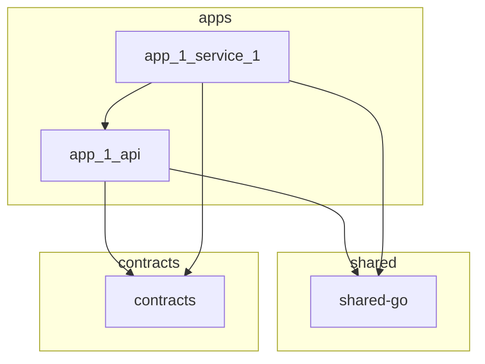

# Cyber Ecosystem Development Guide

## Project Overview

Cyber Ecosystem is a **general-purpose development platform** built with **Go** and **Kratos** framework, using **Monorepo** management pattern and **Nx** as the build tool. It is not a specific business project, but rather a foundation for rapidly building and deploying microservices.

### Architecture Concepts

- **`apps/`** - Contains individual projects that are completely independent of each other. Each project represents a separate domain or service ecosystem.
- **Project Structure** - Each project under `apps/` follows a consistent structure:
  - `api/` - Shared API definitions (protobuf) used by multiple services and clients within the project
  - `services/` - One or more microservices implementing the business logic
  - `clients/` - Optional client libraries for consuming the project's APIs
- **`shared-*`** - Shared packages that provide common functionality across the monorepo (e.g., `shared-go`, `shared-ts`)
- **`infra/`** - Development environment infrastructure configurations (e.g., Docker, Prometheus, Grafana)

---

## Directory Structure

```
cyber-ecosystem/
├── apps/                      # Application layer
│   └── app_1/                # Application 1
│       ├── api/              # API definitions (protobuf)
│       │   └── v1/           # v1 API version
│       │       ├── auth.proto
│       │       ├── blog.proto
│       │       ├── reading.proto
│       │       └── error_reason.proto
│       └── services/         # Service implementations
│           └── service_1/     # Service 1
│               ├── cmd/       # Application entry
│               │   ├── main.go
│               │   ├── wire.go
│               │   └── wire_gen.go
│               ├── internal/   # Internal packages
│               │   ├── biz/   # Business logic layer
│               │   ├── data/  # Data layer (ent ORM)
│               │   ├── server/# Server definitions
│               │   ├── service/# Service implementations
│               │   └── conf/  # Configuration definitions (protobuf)
│               └── configs/   # Configuration files
│                   └── config.yaml
├── contracts/                 # Shared contract definitions
│   ├── common/               # Common message definitions
│   └── errors/               # Error definitions
├── infra/                    # Infrastructure
├── shared-go/               # Shared Go libraries
│   └── kratos/               # Kratos framework extensions
│       ├── logging/          # Logging components
│       ├── middleware/        # Middleware
│       ├── orderby/          # Sorting support
│       ├── orm/              # ORM extensions
│       ├── transport/         # Transport extensions
│       └── utils/             # Utilities
├── tools/                    # Tool definitions
├── nx                        # Nx executable
├── nx.json                  # Nx configuration
├── buf.lock / buf.yaml      # Buf (Protobuf) configuration
├── go.mod / go.sum          # Go dependencies
└── package.json             # Node dependencies
```

---

## Technology Stack

| Area | Technology |
|------|------------|
| **Language** | Go 1.25+ |
| **Framework** | Kratos v2 |
| **Communication** | gRPC, HTTP, ConnectRPC |
| **Database** | PostgreSQL + Ent ORM |
| **Cache** | Redis |
| **Logging** | Zap + Loki |
| **Tracing** | OpenTelemetry (OTLP) |
| **Metrics** | Prometheus |
| **Profiling** | pprof |
| **Protobuf** | Buf |
| **Build** | Nx |

---

## Command Execution Rules

### Core Principle

> **⚠️ IMPORTANT: For all command execution scenarios, you MUST first check if nx has defined the corresponding target.**

### Nx Target Discovery Process

1. Identify the target project (e.g., `app_1_service_1`)
2. Check the `targets` definition in that project's `project.json`
3. Execute using `./nx run <project>:<target>`

### Common Nx Targets

```bash
# Project service_1
./nx run app_1_service_1:generate   # Generate code (proto + wire + ent)
./nx run app_1_service_1:dev        # Start development server
./nx run app_1_service_1:build      # Build project
./nx run app_1_service_1:proto:conf # Generate config proto only

# Tools
./nx run tools:buf:dep      # Update buf dependencies
./nx run tools:buf:format   # Format proto files
./nx run tools:buf:lint     # Lint proto files
./nx run tools:go:init       # Install Go toolchain
```

### Forbidden Behaviors

```bash
# ❌ DO NOT execute directly
cd apps/app_1/services/service_1 && go generate ./...
cd apps/app_1/services/service_1 && make generate
cd apps/app_1/services/service_1 && go build

# ✅ CORRECT way
./nx run app_1_service_1:generate
./nx run app_1_service_1:build
```

### Project Variable References

- `{workspaceRoot}` - Repository root directory
- `{projectRoot}` - Project root directory

---

## Code Generation Flow

### service_1 Project



**Command:**
```bash
./nx run app_1_service_1:generate
```

**Execution Order:**
1. `proto:conf` - Generate `conf.pb.go`
2. `generate` - Execute `go generate` (wire + ent)

---

## Configuration System

### Proto Configuration

- **Location**: `internal/conf/conf.proto`
- **Generate**: `./nx run app_1_service_1:proto:conf`

```protobuf
message Bootstrap {
  Server server = 1;
  Auth auth = 2;
  Log log = 3;
  Data data = 4;
  Trace trace = 5;
  Ops ops = 6;      // Ops port configuration
}
```

### YAML Configuration

- **Location**: `configs/config.yaml`
- **Structure**: One-to-one correspondence with `conf.proto`

```yaml
server:
  http:
    addr: 0.0.0.0:11000
  grpc:
    addr: 0.0.0.0:12000
  connect:
    addr: 0.0.0.0:13000
ops:
  enabled: true
  addr: "0.0.0.0:14000"
  metrics: "/metrics"
  pprof:
    enabled: true
    cpu_enabled: true
    heap_enabled: true
    goroutine_enabled: true
    mutex_enabled: true
    thread_enabled: true
    trace_enabled: true
```

---

## Dependency Injection (Wire)

### File Structure

```
cmd/
├── main.go        # Entry point
├── wire.go        # Injection definitions
└── wire_gen.go    # Auto-generated
```

### wire.go Example

```go
//go:build wireinject

func wireApp(
    *conf.Server,
    *conf.Auth,
    *conf.Log,
    *conf.Data,
    *conf.Ops,
    log.Logger,
    *tracesdk.TracerProvider,
    metric.Int64Counter,
    metric.Float64Histogram,
    *metricsdk.MeterProvider,
) (*kratos.App, func(), error) {
    panic(wire.Build(
        server.ProviderSet,
        service.ProviderSet,
        biz.ProviderSet,
        data.ProviderSet,
        newApp,
    ))
}
```

### Adding a New Provider

1. Define `NewXxx` constructor in the corresponding package's `provider.go`
2. Add `NewXxx` to `wire.NewSet(...)`
3. Add parameter in `wire.go`
4. Run `./nx run app_1_service_1:generate` to regenerate

---

## AI Development Guidance

### 1. Project Understanding

- **Service Layering**: `server` → `service` → `biz` → `data`
- **Configuration-Driven**: Prefer modifying `conf.proto` + `config.yaml`
- **Dependency Injection**: Use Wire for dependency management

### 2. Adding New Feature Flow



### 3. Configuration-First Principle

- Prefer modifying configuration over hardcoding
- Configuration items should be defined in `conf.proto`
- Support runtime hot configuration

### 4. Observability Integration

| Type | Endpoint | Tool |
|------|----------|------|
| **Metrics** | `/metrics` | Prometheus |
| **Traces** | OTLP | Jaeger/Collector |
| **pprof** | `/debug/pprof/*` | go tool pprof |

**Ops Port Architecture:**
```
OpsServer (:14000)
├── /metrics
└── /debug/pprof/*
    ├── profile
    ├── heap
    ├── goroutine
    └── trace
```

### 5. Common Patterns

#### 5.1 Adding a New Server

```go
// 1. Implement NewXxxServer in server package
func NewXxxServer(c *conf.Server, ...) *xxx.Server {
    // ...
}

// 2. Register in wire
var ProviderSet = wire.NewSet(NewXxxServer, ...)

// 3. Modify wire.go to add parameters
// 4. Modify newApp to register server
```

#### 5.2 Adding Middleware

```go
// 1. Implement in middleware package
func Server() middleware.Middleware {
    return func(handler middleware.Handler) middleware.Handler {
        return func(ctx context.Context, req interface{}) (interface{}, error) {
            // Pre-logic
            resp, err := handler(ctx, req)
            // Post-logic
            return resp, err
        }
    }
}

// 2. Add to middlewares slice in server
middlewares = append(middlewares, middleware.Server())
```

#### 5.3 Adding Proto Messages

```protobuf
// 1. Modify proto file
message XxxRequest {
    string name = 1;
}

// 2. Generate code
./nx run app_1_service_1:proto:conf

// 3. Use in biz layer
type XxxRepo interface {
    Create(ctx context.Context, req *pb.XxxRequest) error
}
```

---

## Project Dependencies



**implicitDependencies:**
- `app_1_api` implicitly depends on `contracts`
- `app_1_service_1` implicitly depends on `app_1_api` and `shared-go`

---

## Best Practices

1. **Verify immediately after code generation**
   ```bash
   ./nx run app_1_service_1:generate && ./nx run app_1_service_1:build
   ```

2. **Check completeness after configuration changes**
   - Ensure `conf.proto` and `config.yaml` are synchronized

3. **Keep wire dependencies clear**
   - Avoid circular dependencies
   - Use interfaces over concrete types

4. **pprof endpoints for internal network only**
   - Restrict via Kubernetes NetworkPolicy

5. **Use Buf for Proto Management**
   - Format: `./nx run tools:buf:format`
   - Lint: `./nx run tools:buf:lint`

---

## Common Issues Troubleshooting

| Issue | Troubleshooting |
|-------|-----------------|
| Generation failure | Check `conf.proto` syntax |
| Compilation error | Run `./nx run app_1_service_1:generate` |
| Dependency issues | `go mod tidy` |
| Port conflict | Check port configuration in `config.yaml` |
| Trace not working | Check OTLP endpoint configuration |
