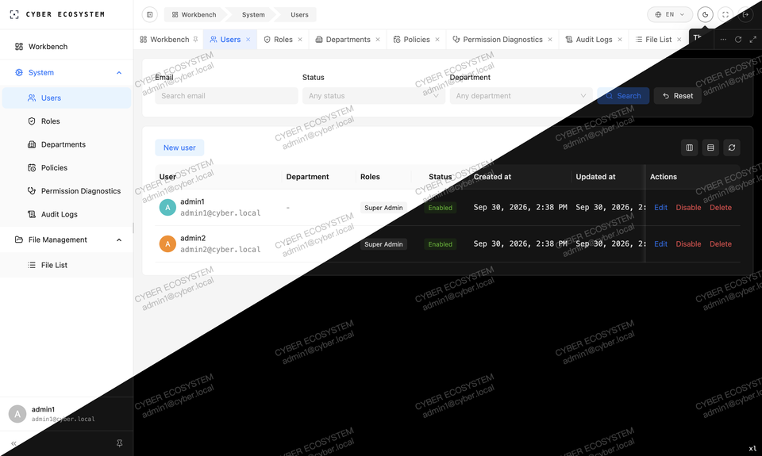

# Cyber Ecosystem

[](https://go.dev) [](https://nodejs.org) [](https://pnpm.io) [](https://nx.dev) [](./LICENSE) [](https://github.com/DrReMain/cyber-ecosystem/commits)

> A contract-first full-stack monorepo for networked applications: a Go (Kratos v3) backend, Connect-RPC contracts, real-time & media infrastructure, and a TanStack Start web client.

## What it is

Cyber Ecosystem is a full-stack monorepo for building networked applications. It is a generic development skeleton rather than a vertical product: one shared base, with business applications composed on top.

`system`, the base service every application deploys, owns the identity core — authentication and sessions, users, org structure, roles, an authorization engine (RBAC / ABAC / data scopes), and the resource catalog. Each application adds its own services under `app/services/` with contracts under `proto/`, owning its aggregates end to end.

Protobuf contracts in `proto/` are the single source of truth; the Go server, TypeScript client, and shared libraries are derived from them.

## Console preview

| Sign-in | Users | Policies (Arabic, RTL) |
| :---: | :---: | :---: |
|  |  |  |

Each image is one screen with its light and dark renderings merged along the diagonal.

## Architecture

### Contracts first

`proto/` is the single source of truth. Each service's contracts live under `proto/cyber/<service>/v1/`, and one Buf pipeline derives three consumers from them: the Go server bindings, the Connect TypeScript client, and an OpenAPI document. Error reasons are declared beside the services that raise them (per-package `error_reason.proto`), so codes and their localized copy can be checked against the contract instead of being scattered across call sites.

### Service anatomy

Every Go service follows one layering, assembled by Wire:

```
cmd/app ─ server ─ module/<domain> ─ platform
                      │                │
                      │                └─ one facade over db / cache / storage / mq
                      │                   + the service's error adapter for each
                      ├─ service.go       RPC surface; thin handlers, no logic
                      ├─ biz.go           use cases against narrow port interfaces
                      └─ repo (data)      ent queries, cache and storage access
```

- Use cases depend on **ports, not implementations** — auth's session store, for example, is a four-method `TokenRP` interface; Redis satisfies it in production and a test double satisfies it anywhere else.
- The `platform` facade centralizes infrastructure handles and their error mappings but owns no lifecycle: Wire chains each provider's cleanup for graceful shutdown and partial injection failure.
- Eleven modules exist today (`user`, `role`, `dept`, `policy`, `authz`, `audit`, `file`, `fileproxy`, `resource`, `auth`, `transfer`). `transfer` is the transport proving ground — echo / pipe / raw / subscribe RPCs exercising unary and streaming paths over all three protocols.

### Capability families

`shared-go/capability` packages infrastructure as **self-contained families**: an interface root (`cache`, `mq`, `storage`) plus backends (`redis`; `nats` and `pg`; `s3`). A family depends only on the stdlib and its own root — it copies out as a unit and never imports service code.

- Interfaces are split by concern, not lumped: `cache.Cache` composes ten sub-interfaces (KV, Hash, List, Set, SortedSet, Counter, Lock, RateLimiter, PubSub, Session); `storage.Storage` exposes a bucket-scoped `View` (Object / List / Presign / Multipart), per-bucket views via `For()`, and a `Limits` query so modules route uploads without touching backend config.
- Each family defines a **backend-agnostic error contract** — sentinels like `ErrCacheMiss` or `ErrNotFound`. The mapping mechanism lives in the family; the concrete app-error instances are injected by each service's platform layer, so a capability never imports a service's error proto while every backend failure still surfaces as a typed, cause-preserving application error.
- Every family ships a **conformance suite** that runs against live infrastructure (Redis, NATS/PostgreSQL parity, S3). Replacing a backend means re-running the suite, not re-reviewing call sites.

### Web client

The `admin` client is feature-sliced along a one-way dependency chain, `libs → stores → domains → services → features → routes`:

- **Routing carries the contract.** Route `staticData` declares a typed title key, menu metadata, and the `operations` a page requires. The nav builder drops any node whose operations are not all granted — an ungranted page never appears in the menu.
- **Typed i18n.** Paraglide compiles five locales (English, Chinese, Arabic, Japanese, Korean) into typed message functions; a missing key is a type error. RTL is expressed as Tailwind `rtl:` variants — no locale-conditional code.
- **Theming via tokens.** One token set drives the light and dark Ant Design themes; component classes carry matching `dark:` variants.
- **Keep-alive tabbed workbench** — affix tabs, history-aware reloads, session-persisted tab state.
- **SSR with server-side custody.** TanStack Start loaders call server functions; session cookies stay HttpOnly on the server and only derived state crosses to the client.

### Authorization model

Roles carry **grants**: an operation pattern, a data-scope kind (`ALL` / `DEPT_TREE` / `SELF`), and optional constraint policies under AND semantics — evaluation fail-closes if a linked policy disappears. Constraint policies are time windows (daily ranges plus weekday sets) or calendars (periodic basis with dated exceptions). Decisions are inspectable: the diagnostics view calls `ExplainOperation` and traces the rules that produced an allow or deny, and administrative actions land in the audit log.

## How mistakes surface early

The codebase leans on compile-time checks and a fixed toolchain so that mistakes — including those introduced by AI-assisted editing — surface at build or generation time rather than at runtime:

- **Strict types end to end** — ent schemas on the server; TanStack Start's strict TypeScript consuming Connect-RPC types generated from proto on the client.
- **One contract, three derived consumers** — a field changed in proto fails the Go build, the client build, or the OpenAPI diff; nothing is hand-synchronized.
- **Typed errors end to end** — error reasons declared beside their services; generated predicates and exhaustively-checked localized copy keep failures actionable on both sides of the wire.
- **Locked toolchain** — Nx runs all generation / build / test steps; generated code in `gen/` is never hand-edited.

## Highlights

- **Broad scope** — CRUD through realtime (streaming, media, meetings) and IoT are all in scope.
- **Identity base service** — `system`: authentication and sessions, users / org / roles, the RBAC + ABAC + data-scope engine, resource catalog, file metadata plane, audit log.
- **Inspectable authorization** — every allow / deny decision traces back to the rules that produced it.
- **Themed, localized console** — light / dark from one token set; five locales including full RTL; keep-alive tabbed navigation; per-session watermark.
- **Type-safe end to end** — contracts flow from proto through Connect-RPC into strict TypeScript; types hold on both sides.
- **Multi-transport, multi-client** — gRPC, HTTP, and Connect from one contract; the web client is current, and the same contracts target React Native, Flutter, and native apps.
- **Capability packs with conformance** — `cache` / `mq` / `storage` families in `shared-go`, verified against live infrastructure.
- **Dual-channel file handling** — service-proxied small uploads, presigned large ones, one metadata plane.
- **Self-hosted infra** — SeaweedFS, Redis, PostgreSQL, NATS, Centrifugo, LiveKit, OpenTelemetry as Docker Compose profiles; managed equivalents can be substituted.
- **Current-generation, single-toolchain** — Go 1.26, TypeScript 7, Nx, Kratos v3, Connect-RPC, Atlas, TanStack Start, Ant Design 6.

## Tech stack

| Layer | Stack |
|---|---|
| Backend | Go · Kratos v3 · Connect-RPC · ent / Atlas migrations |
| Realtime / Media | Centrifugo · LiveKit · NATS |
| Data & Infra | PostgreSQL · Redis · SeaweedFS |
| Observability | OpenTelemetry · SigNoz |
| Frontend | TypeScript · TanStack Start (SSR) · Ant Design · Tailwind CSS · Connect-RPC (web) · Paraglide i18n |
| Tooling | Nx monorepo · Buf · pnpm · Biome |

## Repository layout

```
proto/            Protobuf contracts (source of truth) + errors + generation scripts
gen/              Generated Go / TypeScript — derived, do not edit
app/
  services/system   Go base service (Kratos v3): auth, users / org / roles, authz engine, resource catalog, files
  clients/admin     Web client — TanStack Start + Ant Design
shared-go/        Reusable Go packages: cache · mq · storage (capability packs) + orm · kratos · codegen · helper · utils
shared-ts/        Shared TypeScript packages: error · antd · theme · store · cookie · router-progress · storybook
deploy/           Docker Compose stacks (profile-scoped) + Traefik edge + Postgres bootstrap
tools/            Dev tooling — env init, Go lint / test / format (Nx targets)
docs/             Engineering conventions by area + console screenshots (`docs/screens/`)
```

## Quickstart

> Everything runs through **Nx**; each target is declared in the owning project's `project.json`.

### Prerequisites

- **Go** 1.26+, **Node.js** 24.15+, **pnpm** 11+ (Atlas runs through the workspace via `pnpm exec` — no separate install)
- **Docker** with Compose v2 — for the infra stacks
- Infra reachable at the addresses in `app/services/system/configs/config.yaml` (defaults: Postgres `localhost:5432`, Redis `localhost:6379`; override via env or adjust the config)

### 1. Initialize the environment

Installs the toolchain (grpcurl, buf) and language dependencies (Go modules, pnpm):

```bash
./nx run tools:init
```

### 2. Generate code from contracts

```bash
./nx run system:generate   # ent + wire + go mod tidy
```

### 3. Start the default infra stacks

Raises the Postgres / Redis / SeaweedFS / NATS Compose profiles (realtime / media / observability are opt-in). The Postgres container bootstraps the `system`, `mq`, and `atlas_dev` databases on first start — no manual database creation:

```bash
./nx run deploy:start
./nx run deploy:status     # verify containers are ready
```

### 4. Apply migrations

```bash
./nx run system:migrate:apply
```

### 5. Run it

```bash
./nx run system:dev       # Go backend (Kratos v3)
./nx admin:dev            # Web client (Vite)
```

### Common tasks

- Lint / test / format Go → `./nx run tools:go:lint` · `tools:go:test` · `tools:go:format`.
- Lint proto → `./nx run proto:lint`.
- Edit contracts → `./nx run proto:generate` (review the `gen/` diff).
- Change ent schemas → `./nx run system:generate:ent`.
- Create a migration → `NAME=add_x ./nx run system:migrate:diff`.
- Opt-in stacks → `./nx run deploy:realtime:start` · `deploy:media:start` · `deploy:observability:start`.
- Full stack behind the edge → `./nx run deploy:pre:start` (or `pre:full:start` with every profile).
- Tear down / wipe → `./nx run deploy:stop` · `deploy:reset`.

<details>
<summary><strong>Deployment shapes</strong></summary>

The `deploy/` stacks are Docker Compose files, profile-scoped. Two shapes exist today:

- **dev** — infra (db / storage / mq, opt-in realtime / media / observability) runs in Compose while services run on the host via `system:dev` and the Vite dev server (`deploy:start`).
- **pre** — application images join the Compose stack behind a Traefik edge with host routing and TLS (`deploy:pre:start`; `deploy:pre:full:start` includes every infra profile).

`deploy:reset` tears everything down and removes volumes.

</details>

## Status

Active development. The foundation is complete — capability packs in `shared-go/`, six infra stacks as Compose profiles (db / storage / mq / realtime / media / observability), full Kratos layering, and contract-first generation across Go and TypeScript. The `system` base service is implemented end to end — authentication and sessions, users / org / roles, the RBAC + ABAC + data-scope authorization engine, resource catalog, and the file metadata plane — together with the `admin` web client. Beyond the base, the repository is a skeleton: business applications are meant to grow on it. It is not a finished product.

## License

[MIT](./LICENSE)
