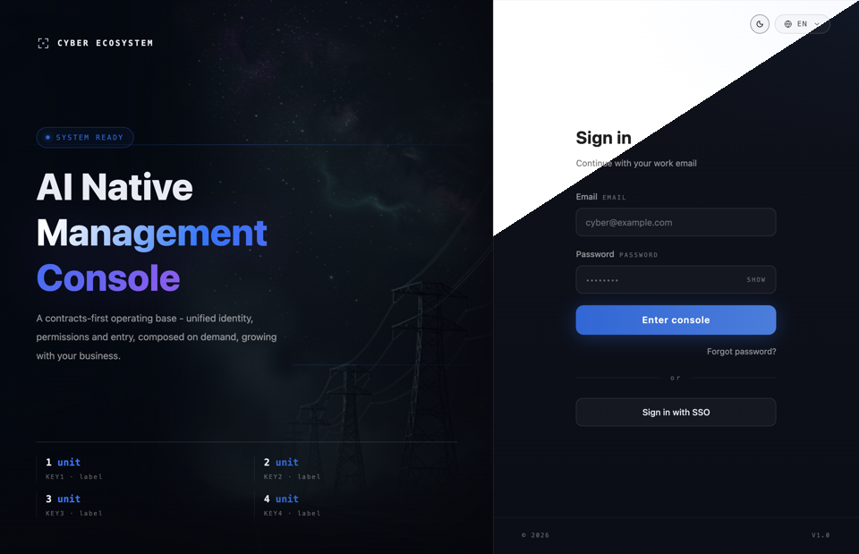
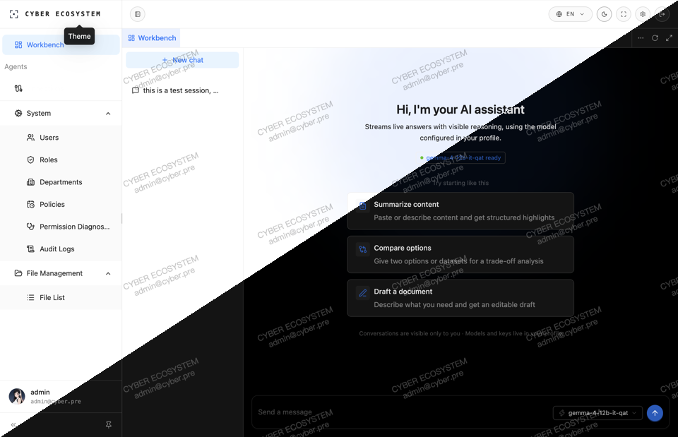
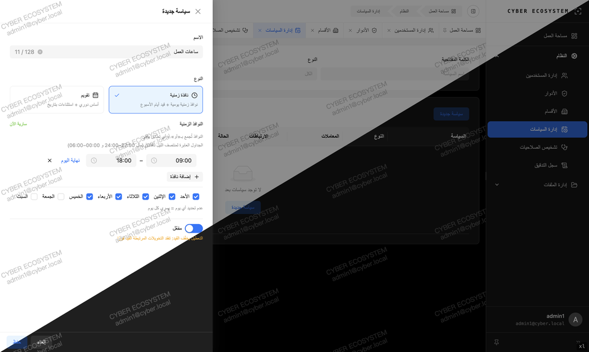
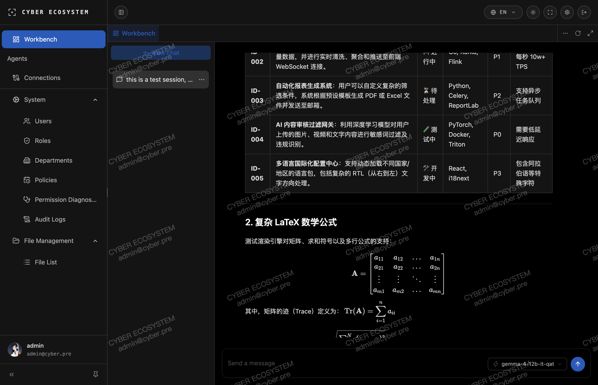
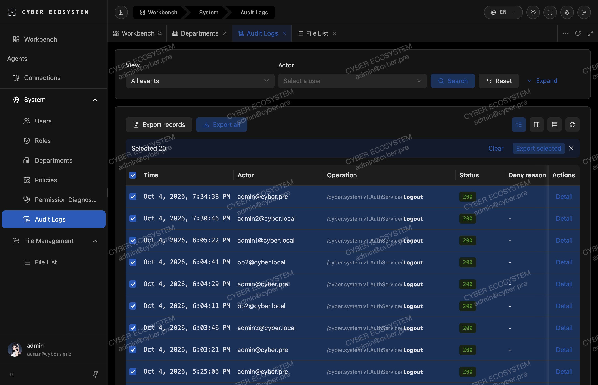
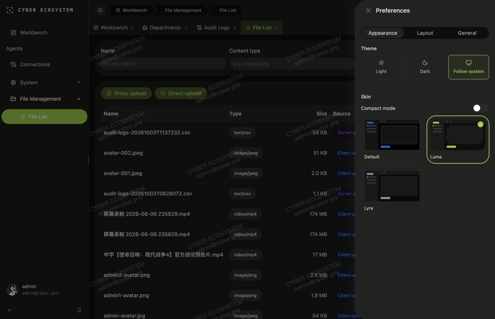

# Cyber Ecosystem

[English](./README.md) · [简体中文](./README.zh-CN.md)

[](https://go.dev) [](https://nodejs.org) [](https://pnpm.io) [](https://nx.dev) [](./LICENSE) [](https://github.com/DrReMain/cyber-ecosystem/commits)

> 面向长期产品的契约先行、AI-native 方向全栈骨架：Go/Kratos 基础服务、第二服务参考实现、Connect-RPC 契约、实时与媒体基础设施，以及 TanStack Start Web 客户端。

## 这是什么

Cyber Ecosystem 是一个**产品开发骨架**，不是一个垂直 SaaS 产品。它的目标是让团队从一个受治理的公共底座分叉长期业务系统，而不是每次都重新拼装身份、授权、传输、文件、实时和管理端范式，然后在迭代中逐渐漂移。

当前仓库包含三个协同部分：

- **`system`**：强制基础服务，拥有认证与会话、用户、组织、角色、RBAC / ABAC / 数据范围授权引擎、操作目录、文件、审计，以及跨服务身份与授权面。
- **`agent`**：第二服务参考实现，拥有每个用户的 Agent 配置和聊天聚合，通过 system introspection 消费身份与授权，示范业务服务如何增加面向用户的 AI 工作流而不复制 IAM。
- **`admin`**：TanStack Start 管理 / 工作台客户端，包含服务端 cookie 保管、权限派生路由、类型化错误、国际化、文件上传与流式聊天消费。

骨架提供共性产品底座；业务行为属于产品服务。

## 控制台预览

| 登录 | Agent 初始界面 | 策略（阿拉伯语 / RTL） |
| :---: | :---: | :---: |
|  |  |  |

| Agent 会话 | 审计日志 | 文件与偏好设置 |
| :---: | :---: | :---: |
|  |  |  |

登录、Agent 初始界面和策略图分别由 light / dark 渲染沿同方向斜线合并。Agent 会话、审计日志、文件与偏好设置是单张真实界面截图。

## 架构

### 契约先行控制面

`proto/` 是唯一事实源。同一份契约会派生：

- Go gRPC / HTTP 绑定；
- Connect 服务注册；
- Connect TypeScript 客户端；
- OpenAPI 文档；
- 用于授权目录的 per-package operation manifest；
- 后端中间件和前端路由消费的 operation 名称。

Method option 还声明 access audience、builtin 状态和 datascope 适用性。漏写 access 注解的业务 RPC 会被 deny-by-default guard 拒绝，而不是静默暴露。

因此契约成为控制面：新增服务 operation 时，角色管理、运行时授权、诊断界面和前端路由模型可以同源更新。

### 整洁架构与 DDD 范式

每个 Go 服务保持相同的应用边界：

```text
proto / Connect / gRPC / HTTP
        ↓
service.go    — 传输适配器；proto ↔ 领域对象转换
biz.go        — 用例、领域对象和端口
data.go       — repository 适配器
platform      — 服务自己的基础设施门面
```

具体规则：

- **传输层是适配器。** `service.go` 保持 RPC handler 薄层，只做生成的消息与领域对象转换。
- **用例依赖端口。** 模块依赖 `TokenRP`、`UserRP`、`AuthzRP` 这类窄接口，不直接依赖 Redis、Ent、S3 或其他服务客户端。
- **仓库是适配器。** `data.go` 用 Ent 和平台能力实现端口。
- **基础设施属于服务边界。** Wire 组合 platform、provider、cleanup 和 server，不把基础设施细节泄漏进用例。
- **边界遵循 DDD。** `system` 与 `agent` 是独立 bounded context。`system.User` 是认证身份核心；业务服务拥有自己的应用聚合，并通过 ID 引用用户，不复制或扩展 system 用户表。
- **跨服务读取走远程适配器。** 业务服务通过 `system` RPC 消费身份与授权，不查询其他服务数据库。

依赖方向因此是：

```text
transport → use case → port ← adapter
                       ↓
                  platform capability
```

业务模块可以用 port fake 测试，可以在接口后替换实现，也可以在服务抽取时保留用例模型。

### 授权模型

角色持有 grant：operation pattern、数据范围和可选约束策略。

- **Operation pattern** 支持精确 RPC、服务通配符和全局 `/*` 管理员模式。
- **数据范围** 支持 all、self、department-tree。
- **约束策略** 按 AND 语义求值；当前实现包含时间窗口和日历策略。
- **失败关闭。** 未知策略类型、属性解析失败或策略求值错误都不会放行。
- **决策可解释。** 诊断界面展示 allow / deny 背后的角色、grant、scope 和每个策略状态。
- **变更版本化。** 授权表编译为内存 snapshot；版本 bump 和通知驱动副本重建，并保留低频 reconcile 兜底。

### AI-native 方向

AI-native 在骨架中分两层：

- **开发期。** 仓库规则、领域 conventions、生成物和 Nx 目标让人类与 coding agent 使用同一套可执行边界。AI 生成速度提高后，契约、权限、生成和文档漂移仍应在构建或生成阶段暴露，而不是进入运行时。
- **运行期。** 当前 `agent` 服务是真实垂直切片：每用户 OpenAI-compatible provider、模型列表、聊天会话和服务端流式响应。平台方向是将 agent、credential、tool、task 和 retrieval 建模为一等 principal 与 IAM operation，而不是把 agent 当成聊天页附件。这些仍是方向，不是当前平台保证。

### 能力族

`shared-go/capability` 将基础设施封装为自包含能力族：

- `cache`：KV、hash、list、set、sorted set、counter、lock、rate limiter、pub/sub、session 接口，Redis 后端。
- `storage`：object、list、presign、multipart、bucket、per-bucket view 和操作限制，S3-compatible 后端。
- `mq`：at-least-once producer / consumer、重试和 DLQ 语义，NATS 与 PostgreSQL 后端。

能力族只依赖标准库、第三方 provider 和自己的接口根，不 import 服务代码，因此可以作为单元复制或抽取。

### Web 客户端

`admin` 按单向依赖链做 feature slicing：

```text
libs → stores → domains → services → features → routes
```

它提供：

- 服务端 HttpOnly cookie 保管；
- SSR loader 与 server function；
- 权限派生菜单和路由守卫；
- 生成的 Connect 类型化客户端；
- 统一错误分类与反馈；
- light / dark 主题、五种语言和 RTL；
- keep-alive 标签页、面包屑和工作台布局；
- 流式聊天消费和可恢复直传。

## 技术栈优势

| 技术 | 在本骨架中的优势 |
|---|---|
| **Protobuf / Buf** | Go、TypeScript、OpenAPI、授权和工具链共用一份类型化契约，减少手工同步和契约漂移。 |
| **Go / Kratos** | 编译型性能、轻量并发和可组合传输 / 中间件架构；服务结构在模块增长后仍保持稳定。 |
| **Connect-RPC** | 在浏览器、服务端、gRPC 与 HTTP 间提供现代 RPC 边界，同时保留 protobuf 类型与高效序列化。 |
| **ent / Atlas** | 类型化 schema 与查询生成，配合版本化迁移，降低裸 SQL 漂移，使数据所有权显式化。 |
| **TanStack Start** | SSR、嵌套路由、类型化路由上下文和 server function 提供强应用壳，同时保留 SPA 式导航体验。 |
| **React Query / Connect Query** | 请求去重、缓存生命周期、mutation 状态和流式集成让数据流可预测。 |
| **Ant Design + Tailwind** | 适合密集管理界面的组件体系，配合 token 化样式、暗色模式和 RTL。 |
| **Redis / S3-compatible storage / NATS 或 PG-MQ** | 能力缝支持本地开发、自托管和托管服务替换。 |
| **OpenTelemetry / SigNoz** | trace、metrics、log 和慢查询钩子进入服务装配，而不是事后补齐。 |
| **Nx** | 声明式工作流让生成、迁移、测试、构建和部署可组合、可复现。 |

## 性能形态

这是架构层面的性能预测，不是基准测试结论。实际结果取决于 schema、索引、provider、部署和负载。

### 后端

- **Go 与 Kratos** 提供编译型、并发友好的服务运行时，单请求框架开销相对低。
- **Connect + protobuf** 在支持的内部 RPC 路径避免手工 JSON 解析，保留紧凑二进制编码。
- **授权使用内存编译 snapshot**，正常决策不需要每次查询 role、permission、policy 和 binding 表。
- **Ent 生成类型化 SQL**，连接池、显式索引和 Atlas 迁移让数据库访问路径可检查。
- **Presign 上传 / 下载** 让大对象字节直接在浏览器和 S3-compatible 存储间传输；应用服务器协调元数据和确认，不代理每个字节。
- **审计发布异步化**，请求路径与 MQ 持久化解耦。
- **流式聊天** 在模型产出时持续发送 delta，而不是等待完整答案。

可能的瓶颈主要来自外部条件与负载：模型 provider、数据库查询、对象存储、跨服务 introspection、策略和数据量。这些位置也都有明确的测量和优化缝。

### 前端

- **SSR** 改善首屏有效渲染，并保持 session cookie 在服务端保管。
- **Route-level code splitting** 限制当前页面加载的 JavaScript 和功能模块。
- **React Query 缓存与去重** 减少重复请求，让 mutation 失效显式化。
- **生成的 Connect 客户端** 避免每次调用手工序列化，并保留编译期 operation 类型。
- **文件直传** 避免大文件经过 admin 服务端。
- **流式 UI 状态** 让模型和传输进度即时可见，不需要等待最终响应。

该前端栈适合 I/O 密集型交互：加载数据、上传文件、消费流。渲染密集型表格仍应由产品侧分页、索引并按需虚拟化。

## 仓库结构

```text
proto/             Protobuf 契约、扩展、生成脚本和 catalog 生成器
gen/               生成的 Go、Connect TypeScript、OpenAPI 和操作目录
app/
  services/system  强制基础服务：IAM、authz、资源目录、文件、审计、introspection
  services/agent   第二服务参考：每用户 Agent 配置与流式聊天
  clients/admin    TanStack Start 管理 / 工作台客户端
shared-go/         可复用 Go 包：能力族、orm、kratos、codegen、helper
shared-ts/         共享 TypeScript 包：error、antd、theme、store、cookie、progress
deploy/            Compose profile、Traefik edge 和迁移 wiring
tools/             仓库初始化与 Go 工具目标
docs/              工程约定与截图
```

## 快速开始

所有已声明工作流都通过 Nx 运行。

### 前置条件

- Go 1.26+
- Node.js 24.15+
- pnpm 11+
- Docker Compose v2

### 1. 初始化工具和依赖

```bash
./nx run tools:init
```

### 2. 生成派生代码

```bash
./nx run system:generate
./nx run agent:generate
```

检查 `gen/` diff；生成文件不允许直接编辑。

### 3. 启动本地基础设施

```bash
./nx run deploy:start
./nx run deploy:status
```

默认 profile 启动 PostgreSQL、Redis、SeaweedFS 和 NATS。Postgres 容器会创建 `system`、`agent`、`mq` 和 `atlas_dev` 数据库。

### 4. 应用迁移

```bash
./nx run system:migrate:apply
./nx run agent:migrate:apply
```

### 5. 运行服务

每个进程使用一个 shell：

```bash
./nx run system:dev
./nx run agent:dev
./nx admin:dev
```

开发代理默认连接 `localhost:13001` 的 system 和 `localhost:13002` 的 agent。用户可以在 admin profile 中配置 OpenAI-compatible provider；API key 在服务端加密，API 永不回显。

仓库内配置包含仅用于开发的默认值，包括种子管理员和 agent master key。任何共享或公网可达部署前必须修改。

### 常用任务

- Proto lint / 生成：`./nx run proto:lint` · `proto:generate`
- Go lint / 测试 / 格式化：`./nx run tools:go:lint` · `tools:go:test` · `tools:go:format`
- Ent 生成：`./nx run system:generate:ent` 或 `agent:generate:ent`
- 迁移 diff：`NAME=add_x ./nx run system:migrate:diff` 或 `agent:migrate:diff`
- 可选栈：`deploy:realtime:start` · `deploy:media:start` · `deploy:observability:start`
- Edge 栈：`deploy:pre:start` 或 `deploy:pre:full:start`
- 关闭 / 清理：`deploy:stop` · `deploy:reset`

## 作为产品底座使用

推荐流程：

1. 从一个已发布的 skeleton snapshot 或 tag 开始。
2. 使用私有产品仓库或隔离产品分支。
3. 在 `app/services/<name>` 添加服务，在 `proto/cyber/<name>/v1` 添加契约。
4. 不把业务聚合放进 `system`。
5. 通过 `system` surface 消费身份与授权。
6. 定期 merge 或 cherry-pick 已发布 skeleton tag。
7. 不把产品特有行为直接合回骨架。能力必须有第二个真实消费者，并附带测试、观测和可复制范式后才回收。

## 开源模型

这个 GitHub 仓库是私有维护骨架的 **curated public snapshot**。开发历史、活跃 roadmap 和实现前沿保持私有。

欢迎公开 issue。公开 pull request 不是主开发路径；有价值的修改会被应用到私有 upstream，并随后续 snapshot 发布。

## 当前状态

积极开发中；基础可用，但尚未完成。

当前已实现：

- `system`：认证、会话、用户、组织、角色、授权、资源目录、文件、审计和跨服务 introspection。
- `agent`：每用户 provider 配置、模型列表、聊天会话和服务端流式响应。
- `admin`：权限派生管理 / 工作台 UI、国际化、文件工作流和流式聊天。

后续平台工作包括运行期 agent principal、API-key credential、工具授权、任务编排、检索集成和更多垂直切片。

## 文档

领域约定见：

- [`docs/conventions/proto/CONVENTIONS.md`](./docs/conventions/proto/CONVENTIONS.md)
- [`docs/conventions/kratos/CONVENTIONS.md`](./docs/conventions/kratos/CONVENTIONS.md)
- [`docs/conventions/tanstack/CONVENTIONS.md`](./docs/conventions/tanstack/CONVENTIONS.md)
- [`docs/conventions/deploy/CONVENTIONS.md`](./docs/conventions/deploy/CONVENTIONS.md)

## License

[MIT](./LICENSE)
