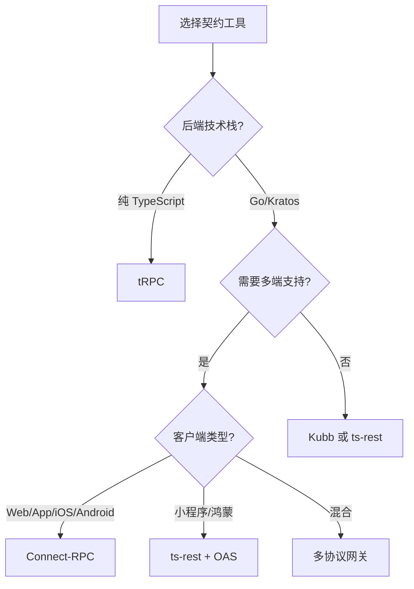

# API 契约技术选型决策

本文档记录关于前后端契约至上的技术选型讨论与决策，涵盖 tRPC、oRPC、ts-rest、Kubb、Connect-RPC 等工具的对比分析。

## 1. 核心目标

实现**全栈类型安全（End-to-End Type Safety）**：后端修改字段，前端立刻红线报错。

## 2. 工具对比矩阵

### 2.1 核心特性对比

| 特性 | tRPC | oRPC | ts-rest | Kubb | Connect-RPC |
|------|------|------|---------|------|-------------|
| 核心哲学 | 代码即协议 | OpenAPI + 类型推导 | 契约优先 | OAS 代码生成 | Protobuf 即真理 |
| 契约源 | TypeScript 类型 | OpenAPI | Zod Contract | OpenAPI | Protobuf |
| 优势 | 速度最快，0 配置 | 类型推导 + Swagger | 解耦性强，多语言友好 | 高度定制化 | 跨语言原生支持 |
| 劣势 | 非 TS 项目无法调用 | 生态较新 | 需要样板代码 | 生成文件臃肿 | 部分平台支持有限 |
| API 风格 | RPC 函数调用 | RPC + REST | RESTful | RESTful | RPC + HTTP |

### 2.2 适用场景分析



## 3. 当前项目架构决策

### 3.1 后端架构

基于 Kratos 框架，提供三套接口：

```text
┌─────────────────────────────────────────────────────────────┐
│                      Kratos Backend                          │
├─────────────────────────────────────────────────────────────┤
│  ┌─────────────┐  ┌─────────────┐  ┌─────────────────────┐  │
│  │   gRPC      │  │ Connect-RPC │  │   HTTP + OAS        │  │
│  │  原生流支持  │  │  Web 友好   │  │  小程序/鸿蒙兼容    │  │
│  └─────────────┘  └─────────────┘  └─────────────────────┘  │
└─────────────────────────────────────────────────────────────┘
```

### 3.2 客户端支持矩阵

| 平台 | Connect-RPC 支持度 | 推荐方案 |
|------|-------------------|----------|
| Web - React/Next.js | 原生支持，顶级 | Connect-RPC |
| iOS | connect-swift，优秀 | Connect-RPC |
| Android | connect-kotlin，优秀 | Connect-RPC |
| Flutter | 社区插件，良好 | Connect-RPC |
| React Native | 需 Polyfill，良好 | Connect-RPC |
| 小程序 - 微信/支付宝 | 极差 | HTTP REST + ts-rest |
| 鸿蒙 | 差 | HTTP REST + ts-rest |
| Rust - Slint/GPUI | 中等 | tonic 或 Connect-RPC |

### 3.3 契约工具定位

```text
┌────────────────────────────────────────────────────────────────┐
│                        契约架构分层                             │
├────────────────────────────────────────────────────────────────┤
│                                                                 │
│   ┌─────────────────────────────────────────────────────────┐  │
│   │              .proto - 唯一真理源 SSOT                    │  │
│   └─────────────────────────────────────────────────────────┘  │
│                              │                                  │
│              ┌───────────────┼───────────────┐                  │
│              ▼               ▼               ▼                  │
│   ┌──────────────┐  ┌──────────────┐  ┌──────────────────┐     │
│   │ Connect-RPC  │  │   gRPC       │  │  HTTP + OAS      │     │
│   │  Web/App     │  │  Rust/IoT    │  │  小程序/鸿蒙     │     │
│   └──────────────┘  └──────────────┘  └──────────────────┘     │
│                              │                                  │
│              ┌───────────────┴───────────────┐                  │
│              ▼                               ▼                  │
│   ┌──────────────────┐            ┌──────────────────────┐     │
│   │ connect-query    │            │ ts-rest / Kubb       │     │
│   │ TanStack Query   │            │ Zod 运行时校验       │     │
│   └──────────────────┘            └──────────────────────┘     │
│                                                                 │
└────────────────────────────────────────────────────────────────┘
```

## 4. ts-rest vs Kubb 决策分析

### 4.1 核心差异

| 维度 | Kubb | ts-rest |
|------|------|---------|
| 生成方式 | 静态生成 .ts 文件 | 运行时 Proxy 代理 |
| 产物 | API 函数、Zod Schema、Hooks | Contract 对象 |
| 灵活性 | 极高，插件化定制 | 中等，遵循框架约定 |
| 维护成本 | 高，依赖模板配置 | 低，标准化 DSL |
| 团队上手 | 需要理解生成配置 | 直接看 Contract |

### 4.2 长期收益评估

**ts-rest 优势：**

- 标准化心智模型，降低团队认知负载
- 契约优先思维，与 Protobuf 理念一致
- 更好的 Zod 集成与运行时校验
- 与 TanStack Query 深度整合

**Kubb 优势：**

- 极致的定制化能力
- 适合超大型、非标准 OAS 项目
- 可生成特殊文档和注释

### 4.3 决策建议

在 Connect-RPC 引入后：

- **Connect-RPC**：核心业务 CRUD，主契约层
- **ts-rest**：兼容层，处理小程序/鸿蒙/外部 API
- **Kubb**：边缘化，仅用于特殊文档生成需求

## 5. 非传统场景的契约方案

### 5.1 场景-方案矩阵

| 场景 | 推荐契约协议 | 实现工具 | 契约硬度 |
|------|-------------|----------|----------|
| 大文件/断点续传 | Connect-RPC Streaming | buf + Kratos | ⭐⭐⭐⭐⭐ |
| 实时消息 - WebSocket/MQTT | AsyncAPI | WarpDrive/Symmetry | ⭐⭐⭐⭐ |
| 实时日志/状态推送 - SSE | Connect-RPC Server Stream | connect-query | ⭐⭐⭐⭐⭐ |
| 流媒体传输 | HLS/DASH | 标准协议，无需自定义契约 | N/A |

### 5.2 文件处理契约设计

```protobuf
// 断点续传 Proto 定义示例
message UploadRequest {
  bytes data = 1;
  int64 offset = 2;
  string upload_id = 3;
}

message UploadResponse {
  string upload_id = 1;
  int64 received_offset = 2;
  bool complete = 3;
}

service FileService {
  rpc Upload(stream UploadRequest) returns (UploadResponse);
  rpc Download(DownloadRequest) returns (stream FileChunk);
}
```

### 5.3 实时消息契约设计

**AsyncAPI 示例：**

```yaml
asyncapi: '2.6.0'
info:
  title: 审批流实时通知
  version: '1.0.0'
channels:
  approval/{approvalId}/events:
    subscribe:
      message:
        name: ApprovalEvent
        payload:
          type: object
          properties:
            approvalId:
              type: string
            action:
              type: string
              enum: [submit, approve, reject, countersign]
            actor:
              $ref: '#/components/schemas/User'
```

## 6. 多协议网关架构

### 6.1 统一抽象层

```text
┌─────────────────────────────────────────────────────────────────┐
│                        Kratos Middleware                         │
├─────────────────────────────────────────────────────────────────┤
│  ┌────────────────────────────────────────────────────────────┐ │
│  │                    Auth Middleware                          │ │
│  │  统一提取 token：gRPC metadata / Connect header / HTTP cookie│ │
│  └────────────────────────────────────────────────────────────┘ │
│  ┌────────────────────────────────────────────────────────────┐ │
│  │                    RBAC Middleware                          │ │
│  │  统一权限校验：Casbin / OPA                                 │ │
│  │  抽象为 Subject, Object, Action                            │ │
│  └────────────────────────────────────────────────────────────┘ │
└─────────────────────────────────────────────────────────────────┘
```

### 6.2 流式通信适配器

```text
┌─────────────────────────────────────────────────────────────────┐
│                      业务逻辑层 Usecase                           │
│  定义 StreamHandler 接口，产生 chan 或 AsyncIterable             │
└─────────────────────────────────────────────────────────────────┘
                              │
              ┌───────────────┼───────────────┐
              ▼               ▼               ▼
   ┌──────────────┐  ┌──────────────┐  ┌──────────────┐
   │ gRPC 适配器  │  │Connect 适配器│  │ SSE 适配器   │
   │ chan -> Stream│ │chan -> AsyncIter│ │chan -> EventSource│
   └──────────────┘  └──────────────┘  └──────────────┘
```

### 6.3 关键设计原则

1. **业务代码不感知协议**：永远不出现 `grpc.ServerStream` 或 `http.ResponseWriter`
2. **权限在中间件统一处理**：三套接口共享同一套权限逻辑
3. **流数据统一抽象**：业务层只产生数据，协议层负责序列化

## 7. 实施路线图

### 7.1 短期 - 当前状态

- [x] Kratos 后端提供 gRPC + HTTP 两套接口
- [x] 自动生成 OpenAPI 规范
- [ ] 引入 Connect-RPC 支持

### 7.2 中期 - 契约架构升级

- [ ] 配置 buf 工具链，同时生成 Go/TS/OpenAPI
- [ ] Web 端迁移到 Connect-RPC + TanStack Query
- [ ] 小程序端使用 ts-rest 消费 OAS

### 7.3 长期 - 多端契约统一

- [ ] 建立 api-contract 包，包含：
  - 生成的 Proto 代码 - 供 Web/App 使用
  - 生成的 Zod 契约/ts-rest - 供小程序/外部 API 使用
- [ ] 完善流式通信的契约定义
- [ ] 引入 AsyncAPI 定义 WebSocket/MQTT 消息格式

## 8. 决策记录

| 日期 | 决策 | 理由 |
|------|------|------|
| 2026-03-23 | 选择 ts-rest 而非 Kubb 作为兼容层 | 标准化心智模型，与 Protobuf 契约思维一致，降低团队维护成本 |
| 2026-03-23 | 规划引入 Connect-RPC | 原生支持流式通信，跨语言支持完善，与 Kratos 生态契合 |
| 2026-03-23 | 保留 HTTP + OAS 作为兼容层 | 小程序、鸿蒙等平台对 Connect-RPC 支持有限 |

## 9. 参考资料

- [Connect-RPC 官方文档](https://connectrpc.com/docs)
- [ts-rest 官方文档](https://ts-rest.com/)
- [Buf 工具链](https://buf.build/)
- [AsyncAPI 规范](https://www.asyncapi.com/)
- [Kratos 框架](https://go-kratos.dev/)
